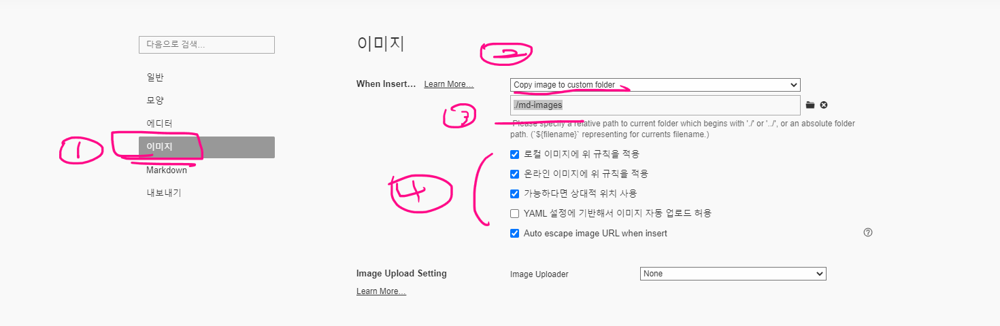

# #는 딱 한번만 쓰자.
#나 ##는 '의미가 있는' 애들 앞에 붙이는 거기때문이다. 특히 #는 파일 하나 당 딱 한번만 쓰도록 하자.

## 코드블록
```bash
$ mkdir java-projects  # 폴더 생성(make directory)
$ cd java-projects # 폴더 이동 (change directory)
$ touch a.txt  # 파일 생성
$ ls # 파일/폴더 목록 보기(list)
```
---

## 목차
[toc]하면 typora에서 목차를 자동으로 생성해준다 

## 표 

만들고자 하는 표의 컬럼을 `|(파이프 -> enter key 위쪽에 있음)` 로 감싸서 지정할 수 있음 

|  이름  | 나이 | 생년월일   |      |
| :----: | ---- | ---------- | ---- |
| 홍길동 | 100  | 1400.04.04 |      |
|        |      |            |      |
|        |      |            |      |
---

## 이미지

``

- 절대 경로 
  - 첫 시작부터 끝까지 모든 주소를 하나하나 다 입력
- 상대 경로
  - 현재 마크다운 문서를 기준으로 이미지가 어디에 위치해 있는지


  
typora 설정이다.  

---

## 링크

`[](여기에 링크를 넣으면 됩니다)`

랜덤 이미지는 [lorem picsum](https://picsum.photos/200/300) 에서 확인할 수 있습니다.