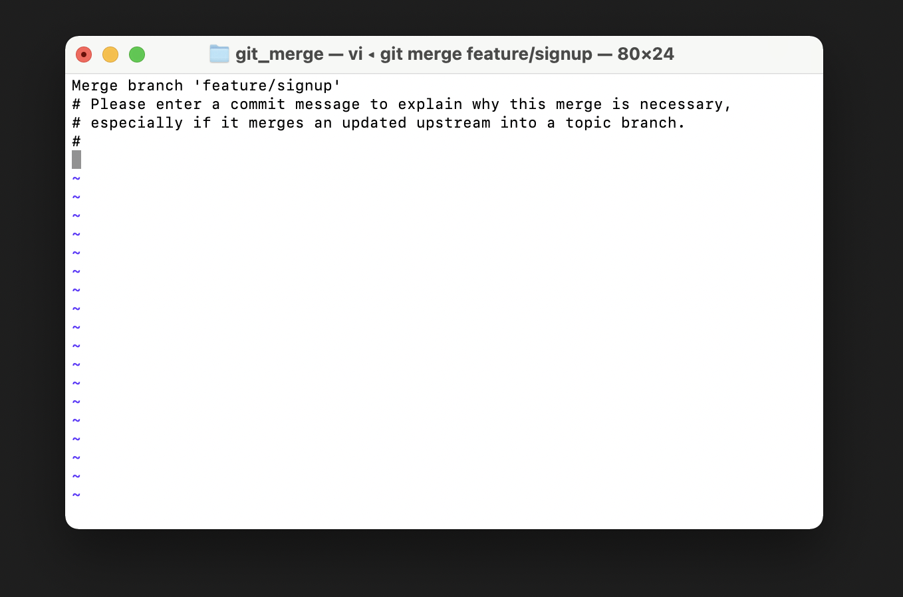

## 0. Git 초기 설정

**커밋(버전) 작성자(author) 설정**

- commit을 누가 작성(author)했는지 알 수 있게 설정해야 한다. 
- 최초 1회 설정하면 그 이후는 (변경 사항이 없다면) 설정해야 할 필요가 없다.
- 이는 `인증(로그인)`과는 전혀 관계없음

```bash
$ git config --global user.name "justin kim"
$ git config --global user.email "edujustin.hphk@gmail.com" # github에 가입한 이메일과 동일해야 한다. 
```

설정값 확인

```bash
$ git config --global --list # --l (list의 shortcut)
user.name=justin kim
user.email=edujustin.hphk@gmail.com
```

만약 전역 영역이 아닌 특정한 git 로컬 디렉토리에서 author를 설정하고 싶다면?  

```bash
$ git config --local user.name "justin kim"
$ git config --local user.email "edujustin.hphk@gmail.com" 

# 혹은 --local 붙이지 않으면 기본값이 로컬 설정
```

**커밋 편집기 변경**  

- 기본 텍스트 편집기인 `vim`을 `vs code`로 대체하는 것

```bash
$ git config --global core.editor "code --wait"
```

### Git basic
`$ ls -a`  

```bash
# commit을 하기 위한 변경 사항들
Changes to be committed:
  (use "git rm --cached <file>..." to unstage)
        new file:   a.txt

# 아직 트래킹되지 않은 (SA에 올라가지 않은) 파일 
Untracked files:
  (use "git add <file>..." to include in what will be committed)
        b.txt
```

`git add folder` # 특정한 폴더(폴더 내부 파일 포함)만 올린다.  

왜 add(SA)가 필요할까?  

- 버전을 한번에 기록하는 것이 아니라 따로 기록할 수 있음!
  - 일부분의 버전만 따로 commit을 할 수 있음
  - commit을 다시 할 수 있음(`amend`)
- git과 같은 버전 관리 시스템에서만 쓰이는 것이 아니라 웹 개발 분야에 널리 쓰이는 개념 

커밋 목록은 `log` 명령어를 통해서 확인 가능

```bash
Changes not staged for commit: # commit을 위한 변화 사항이 아직 staged(무대 위로 올라가지 않은 상황) 되지 않은 요소
  (use "git add <file>..." to update what will be committed)
  (use "git restore <file>..." to discard changes in working directory)
        modified:   a.txt

Untracked files: # 여전히 untracked인 상태(한번도 commit하지 않음)
  (use "git add <file>..." to include in what will be committed)
        b.txt

no changes added to commit (use "git add" and/or "git commit -a")
```

### 최종 정리


### 주의 해야 할 사항!!

- `$ git init` 명령어는 git이 관리하려고 하는 폴더의 '최상단 폴더'에 딱 한번 작성해야 합니다.
- `git init` 을 수행한 폴더 내부에 다른 폴더를 만들고 다시 `git init` 하면 안됨!!!!!

-------------------------------------------------------------------

## 1. remote, push

### 원격 저장소 주소 추가

- "git아! 원격 저장소(remote)를 추가(add)해줘 origin이라는 이름으로!!!"
- origin은 저장소 URL에 별명(?)을 붙였다고 생각하면 된다.
  - 만약 `origin`이라는 별명을 붙여주지 않는다면?
  - push 할 때 `$ git push origin https://github.com/edujustin-hphk/practice.git` 항상 이렇게 긴 URL을 모두 직접 입력해야 한다.
- 참고적으로 `origin`이라는 이름을 반드시 사용해야하는 것은 아니지만 일반적으로 `origin`을 사용한다.

```bash
$ git remote add origin https://github.com/edujustin-hphk/practice.git # 저장소 URL은 본인 repo의 URL을 등록하면 됨
```

### 원격 저장소 목록 보기

만약 등록한 remote url을 삭제하고 싶다면?

```bash
$ git remote rm origin # rm -> remove
```

### 원격 저장소에 업로드(push)

- 최초 1회는 로그인 필요 -> 이때 git bash를 vscode에서 열어서 로그인을 진행 해야 한다.

  - `ctrl + shift + p` -> `>default` 입력 -> `Terminal: Select Default Profile` 클릭 -> `git bash 선택`

  - 이후 터미널 종료 후 재실행


- "git아 push해줘! origin이라는 이름의 원격 저장소로 master 브랜치를!!!"
  - 첫 로그인 화면에서는 그냥 `enter`만 눌러주자!


-------------------------------------------------

## 2. pull, clone

`git pull origin master`  
단, github에서 commit을 직접 발생 시키는 행위는 지양해야 함  

```bash
# 만약 원격 저장소의 이름을 사용하지 않고 다른 이름을 쓰려고 하면? 공백을 두고 입력한다.
$ git clone https://github.com/edujustin-hphk/TIL.git TIL-test
```

clone하면 git init, remote 전부 자동으로 돼있음.  

---------------------------------------------------

## 3. gitignore

token, AWS key 외부에 노출이 되면 안됨 (-> github에 올라가면 안됨)  
일반적으로  `git init`을 수행한 곳(== 최상단 디렉토리)에 작성한다.
아래와 같은 형태로 git이 관리하지 않게 만들 수 있다.  

```bash
venv/ # 특정한 폴더 
token.txt # 특정한 파일
*.txt # 특정한 확장자를 가진 파일
```

### gitignore.io

https://www.toptal.com/developers/gitignore

- 운영체제, 언어, 프레임워크 등의 환경에서 (일반적으로) git으로 관리하지 않는 요소를 미리 만들어 놓은 사이트

------------------------------------------------------

## 4. push error
pull 진행

- vs code 에디터가 나타냄
- x 눌러서 종료하면 끝

`HEAD`는 현재 위치한 브랜치의 최신 commit을 가리킴!

```bash
$ cat .git/HEAD
ref: refs/heads/master
```

--------------------------------------------------------

## 5. Branch (command)

```
생성 :  git branch 브랜치이름  
목록 : git branch  
이동 : git checkout 브랜치이름  
생성 & 이동 : git checkout -b feature2 
삭제 : git branch -d feature2 
강제 삭제 : git branch -D feature
```
완전히 merge되지 않은 브랜치를 삭제 하려고 할 때 에러 발생한다.  

병합할때는 꼭 병합고자 하는 브랜치에서 병합한다(예: master로 이동해서 병합한다)
```bash
# master 브랜치 이동
$ git checkout master
$ git merge feature2
```

------------------------------------------------------------

## 6. Branch scenario

- 현재 `HEAD`는 다음 commit의 부모 commit이 된다.  
- 브랜치를 생성할 때 master 브랜치에 첫 commit을 남겨 놓고 진행해야 함!!  
- `git log --all --oneline --graph`
### Merge
merge는 세가지 경우가 있다.  

#### 1. fast-forward
다른 브랜치가 생성된 이후에 master 브랜치에 변경사항이 없는 경우이다. 단순히 포인터를 최신 commit으로 옮기는 방식이다.  
  
그림은 우리가 feature/login을 삭제한 그림이라고 이해하면된다.  

#### 2. Merge commit
다른 브랜치가 생성된 이후에 master 브랜치에 변경사항이 있는 경우  

#### 2.1 충돌x
  

참고 : 혹시나 아래와 같은 화면이 나타나면서 움직이지 않는다면? => `esc` + `:wq` + `enter` !!  
  

#### 2.2 충돌o
변경 사항이 겹쳐서 git이 어떤 내용으로 병합해야 할 지 알 수 없는 경우  
  
master 브랜치에서 변경한 내용으로 합칠지 hotfix 브랜치에서 변경한 내용을 합칠지 git은 알 수 없기 때문에 직접 선택해서 알려줘야 하는 것이다.  
아래와 같이 내용을 수정한다.  
```bash
# test.txt

master test 1
Merge 충돌을 해결했습니다!
```


--------------------------------------------------------------

## 7. undoing
### 1. 파일을 SA에서 WD로 내리기

1. `$ git rm --cached <file>`
   - commit 이력이 없을 때 SA -> WD
2. `$ git restore --staged <file>`
   - commit 이력이 있을 때 SA -> WD

예 : `$ git restore --staged a.txt`  

### 2. WD에 있는 modified된 파일을 되돌리는 방법
- 우리가 git status를 해보면 modified(수정된)가 붙어있는 애들이 있다. 이들은 commit이력이 있는 애들이다. commit이력이 없는 애들을 아무리 수정해봐도 modified가 안붙는 거보면 untracked라서 그런 것 같다. 즉 git이 관리하는 애들은 내용을 수정하면 modified가 붙는 다는 것이다.
- 기존 파일을 덮어쓰는 방식으로 진행하기 때문에 원래 내용은 모두 사라진다!  
- 수정한 내용이 '정말로' 마음에 들지 않을 경우만 사용해야 한다. 해당 명령어를 수행하면 '절대로' 다시 원래로 돌릴 수 없다!!!!  

예 : $ git restore a.txt  

### 3. 완료한 커밋 수정하는 방법
`$ git commit --amend`
#### 3.1 커밋 메시지를 수정하고싶다
마지막으로 작성한 커밋 메시지를 되돌리는 방법. 주의해야 할 것은 직전 commit 메시지만 수정 가능하다.  
단, 공개된 저장소(github, gitlab, bitbucket)에 push한 commit 메시지는 절대로 수정 금지이다. commit hash 값이 변경되기 때문이다!!  
방법 : `$ git commit --amend`하면 vscode가 열리고 commit 메시지 수정후 닫으면 완료된다.  

#### 3.2 어떤 파일을 빼놓고 commit을 한 경우
예를 들면  
```bash
$ touch foo.txt bar.txt
$ git add foo.txt
$ git commit -m "foo & bar"
```
했다고 하자. 실수로 bar.txt를 커밋하지 않았다.  
그랬을때 bar.txt를 "foo & bar" 커밋에 포함시키고 싶으면 다음과 같이한다.  
먼저 SA에 bar을 올린다  
그다음에 `$ git commit --amend`을하면 vscode가 열리고  
```
# On branch master
# Changes to be committed:
#	new file:   bar.txt
#	new file:   foo.txt
```
이런식으로 수정해준다음 파일을 닫으면 완료.

------------------------------------------------------------
## 8 reset vs revert
### 1. reset
시계를 과거로 돌려버림!!  
- 특정 커밋으로 되돌아가며 특정 커밋 이후의 모든 커밋은 사라진다. 
- 파일의 상태는 옵션으로 결정한다.
- commit의 history가 바뀌기 때문에 **다른 사람과 공유하는 브랜치가 있는 경우 절대 사용하면 안됨**  

**3가지 옵션**  
1. `--soft`
   - reset하기 전까지 했던 SA, WD 작업은 그대로 남겨둠
   - 이후의 commit된 파일들을 SA로 돌려놓는다. (==commit 이전의 상태)
   - 바로 다시 commit을 할 수 있는 상태가 된다!

2. `--mixed`
   - SA reset, WD 작업물만 남겨둠
   - 이후의 commit된 파일을 WD로 돌려놓는다. (==add를 하기 전 상태)
   - 옵션을 지정하지 않으면 이게 기본값이다.

3. `--hard`
   - 이후의 commit된 파일을 모두 WD에서 삭제
   - 단, Untracked된 파일은 Untracked 
   - reset을 하기전 SA, WD 모든 작업물을 reset

예 :  git log --oneline했더니 다음과 같이나왔다.
```bash
3e53137 (HEAD -> master) foo & bar
c03c83b finish all things
ae0eeca first commit
```
c03c83b로 돌아가고싶다. 그러면
```bash
git reset c03c83b --hard
```
하면된다.

### 2. revert
특정한 사건을 없었던 일로 만들어버림!!  
- 이전 커밋 이력은 그대로 남겨둠  
- 커밋 히스토리의 변경 없이 해당 커밋의 내용만을 삭제한 상태의 새로운 커밋을 남김  

사용법 : git revert 해시값 하면 vs code에디터 창이 나오고 종료하면 완료. 그리고 git log 해보면 commit이 생겼다.  

reset과의 차이점은 reset은 commit 이력이 없기 때문에 다시 돌아갈 수 없지만 revert는 이전 commit 이력이 모두 남겨져 있기 때문에 다시 돌아갈 수 있다!  

- 다른 사람과 공유하는 브랜치에서 이전 커밋을 수정하고 싶을 때 사용하자. 커밋 이력이 변경되지 않기 때문에 충돌이 발생하지않기 때문이다.  


------------------------------------------------------------
## 99. switch, restore

### Experimental alternatives for git checkout

> https://github.blog/2019-08-16-highlights-from-git-2-23/
>
> git 2.23 부터 `git checkout`을 대안하기 위해 신규 명령어 `switch`와 `restore`를 도입 
>
> **기존 `checkout` 의 많은 책임을 깔끔하게 분리하여 각각 명확하게 구분 하기 위함**

- `checkout`
  - Switch branches or restore
- `switch`
  - Switch branches
- `restore`
  - Restore working tree files


#### 명령어 비교

**브랜치 이동**

```bash
# 기존
$ git checkout 브랜치명

# 신규
$ git switch 브랜치명
```


**브랜치 생성 및 이동**

```bash
# 기존
$ git checkout -b 브랜치명

# 신규
$ git switch -c 브랜치명
```


**Unstaged 상태의 변경(modified) 파일을 복구**

```bash
# 기존
$ git checkout -- README.md

# 신규
$ git restore README.md
```

#### 결론

> "checkout이 switch, restore의 기능을 모두 수행 할 수 있지만 각자 더 명확한 목적에 맞게 사용하자"

`switch`

- switch is created for the **single purpose of changing branches**, and when you do that, **you do want to be at the HEAD of that branch**.


`checkout`

- checkout is a more general operation which brings your working copy in line with any given state in the history (= like commit)
